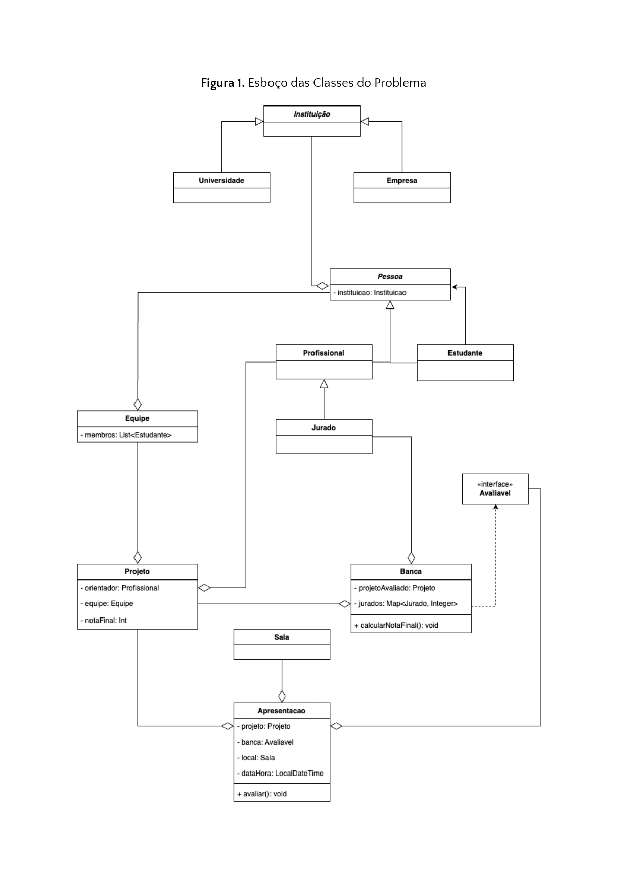

# 🚀 Sistema de Gerenciamento de Hackathons Universitários

Este projeto foi desenvolvido para a disciplina de **Programação Modular** do curso de Engenharia de Software da PUC Minas.  
O sistema simula o gerenciamento de equipes, projetos e apresentações avaliadas em um **Hackathon Universitário**, conforme especificado no modelo UML fornecido.

---

## 🧩 Funcionalidades

- Criação de **Equipes** com até 5 estudantes  
- Associação de **Projetos** a equipes e orientadores  
- Formação de **Bancas Avaliadoras** com 4 jurados  
- Registro de **notas individuais** por jurado  
- Cálculo automático da **nota final** (média das notas)  
- Registro de **Apresentações** com data, hora e local  
- Listagem de **projetos aprovados** (nota final ≥ 7) usando `stream`

---

## 🗂️ Estrutura do Projeto

- `Pessoa` (classe abstrata)  
  - `Estudante`  
  - `Profissional`  
    - `Jurado`  
- `Instituicao`  
  - `Universidade`  
  - `Empresa`  
- `Equipe`  
- `Projeto`  
- `Sala`  
- `Banca` (implementa `Avaliavel`)  
- `Apresentacao`  
- `Singletons:` `Equipes` e `Apresentacoes`

---

## ✅ Tecnologias

- Linguagem: **Java 11+**  
- IDE recomendada: **IntelliJ IDEA** ou **Eclipse**  
- Persistência: **Memória (sem banco de dados)**

---

## 🧪 Execução

O ponto de entrada do sistema é a classe `Principal.java`, que:

1. Cria universidades, estudantes e jurados  
2. Monta equipes e projetos  
3. Forma bancas e registra notas  
4. Calcula a média de cada projeto  
5. Lista os projetos com nota ≥ 7

---

## 📌 Exemplo de saída:

=== PROJETOS APROVADOS (nota ≥ 7) ===
Projeto: EcoApp | Equipe: Tech Titans | Nota Final: 8

---

## 📄 UML

---

## 👩‍💻 Autoria

- **Desenvolvedora:** Rafaela Oliveira Ribeiro  
- **Disciplina:** Programação Modular – PUC Minas  
- **Professor:** Daniel Kansaon
